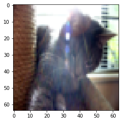

# Hi, this is my study statistic algorithms i've implemented while DataRoot course(Supervised learning):

+ Lineral regression with one variable;
+ Lineral regression with multiple variables;
+ **Logistic regression**;
+ Polynomial Ridge Regression;


# Logistic regression   

*Logistic regression, despite its name, is a classification model rather than regression model. It means that as output we will have {0,1}, **True or False***<br/>
Logistic regression is a simple and more efficient method for binary and linear classification problems.<br/>
In this example, it is used to classify pictures with and without cats.


>E.G. we can also use Logistic R. to predict a political candidate will win{1} or lose{0} or an email spam{1} or not{0}

# Sigmoid function

Logistic regression algorithm is based on Sigmoid function. It is a  "S"-shaped curved mathematical function that ranges from 0 to 1.<br/>
If "our function" goes to infinity, Y(predicted) will become 1 and if it goes to negative infinity, Y(predicted) will become 0.

")​


# Project Structure

To keep code organized, it's important to make project structure well.

```

project
    │──── core              - main parts of core. 
    │       ├── optimize.py         - update function.
    │       ├── regression.py       - main components of linReg.
    │       └── regression.py       - sigmoid function implementation
    │   
    │   
    │──── data            - data manipulation
    │       └── dataPreparation.py   - data load and standardization.
    │     
    │
    └───── interactor             
            └── index.py.            - script to run logistic regression.

```


## Data view

As a input data, we have two **Hierarchical Data Format** files:
+ test_cats.h5;
+ train_cats.h5;

[**.h5**](https://en.wikipedia.org/wiki/Hierarchical_Data_Format) files cannot be easily shown as previous ones cause they contain extremely large amount of input data as multidimensional arrays.<br/>
Each image has three features(64(width), 64(height) and 3(RGB)) and we need to have all the pixels as features. **So, total number of features will be: 64*64*3 = 12228**.**

Let's try to show the pictrure:

```python
import matplotlib.pyplot as plt
import random

index = random.randint(1,train_set_x.shape[1])  #index of image to choose
plt.imshow(train_set_x[:,index].reshape((64, 64, 3)))
```

As a result,we have:

​

### Standardization

To represent color images, the red, green and blue channels (RGB) must be specified for each pixel, and so the pixel value is actually a vector of three numbers ranging from 0 to 255.

>Before run of our algorithm, we have to standardize our data(This process will make gradient descent work faster)
it is simpler and more convenient and works almost as well to just divide every row of the dataset by 255 (the maximum value of a pixel channel).
```python

train_set_x = train_set_x / 255.
test_set_x = test_set_x / 255.
```

## The results

")​

")​