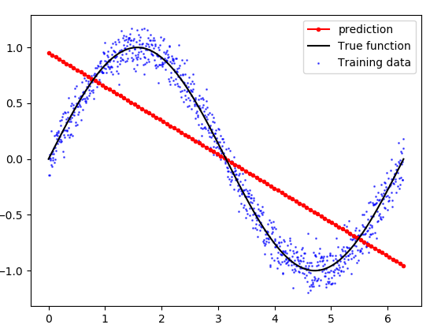
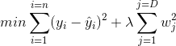

# Hi, this is my study statistic algorithms i've implemented while DataRoot course(Supervised learning):

+ Lineral regression with one variable;
+ Lineral regression with multiple variables;
+ Logistic regression;
+ **Polynomial Ridge Regression;**


# Polynomial Ridge Regression  

Not everything we can visualise with a straight line. Sometimes the prediction may be unpredictable. In case of this, our solution is **Polynomial Ridge Regression**.
In this type of regression the input parameters are used to create higher nth degree polynomials on which a model is trained for prediction. As a result, we will have a curve representing our dataset.

​


As for **Ridge regression**, it's quite useful regularization technique used to adress over-fitting*(when a statistical model fits exactly against its training data and againts test examples fails).*

It is very similar to Linear Regression only that it differs in cost function. Here we have some **penalty term(lambda)** <br/>The lambda parameter controls the shrinkage of the term. If it’s set to 0 then the entire equation becomes like normal Linear Regression curve and high values of lambda ensure the ridge regression to overfit the data.


# Ridge regression formula used in algorithm:

​


# Project Structure

To keep code organized, it's important to make project structure well.
```

project
    │──── core                            - main parts of projects. 
    │       └── ridgeRegularization       - main components of L2(Ridge) regularization
    │
    │ 
    │──── utils                           - additional useful parts of project
    │       └── featureTransform.py       - feature polynomial combinations
    │
    │
    │──── data                            - data manipulation
    │       ├── dataPreparation.py        - data load and standardization 
    │       └── dataVisualisation.py      - test/train visualisation
    │
    │
    └───── interactor             
            └── index.py.                 - script to run polynomial regression

```


## Data view

Here how our data set looks like:(head())

 |Days(0 to 1) | Temperature|
 |-------------|-----------:|
 |	0.00273224|	0.1  |  
 |	0.00546448|	-4.5 |
 |	0.00819672|	-6.3 |
 |	0.01092896|	-9.6 |
 |	0.01366120|	-9.9|	

## Brief info

**Our Day feature is already normalized to 0-1 range, so next, we will multiply it by 366 to restore the correct day of the year.**

> In this example, out goal is to predict annual temperature, visualise polynomial dependence our data.

## Dataset visualisation

Here is shown temperature dependency from days in year:

")​


## The results using matplot

```python

# Predict for all points in set
y_val = model.predict(full_feature_set_for_plot)
    
# Plot the results
m1 = plt.scatter(366 * train_set_x, train_set_y, color=cmap(0.9), s=10)
m2 = plt.scatter(366 * test_set_x, test_set_y, color=cmap(0.5), s=10)
plt.plot(366 * full_feature_set_for_plot.T, y_val.T, color='black', linewidth=2, label="Prediction")
plt.suptitle("Polynomial Ridge Regression")
plt.title("MSE: %.2f" % mse, fontsize=10)
plt.xlabel('Day')
plt.ylabel('Temperature in Celcius')
plt.legend((m1, m2), ("Training data", "Test data"), loc='lower right')
plt.show()

```

As we can see, our model fits well the hypothesis function to the data. Despite having high-degree polynomials, we prevented overfitting by using the **L2 Regularization(Ridge)** - method for penalizing high magnitudes of parameters estimates. Also we implemented *Polynomial Ridge Regression* model with OOP in mind.

")​